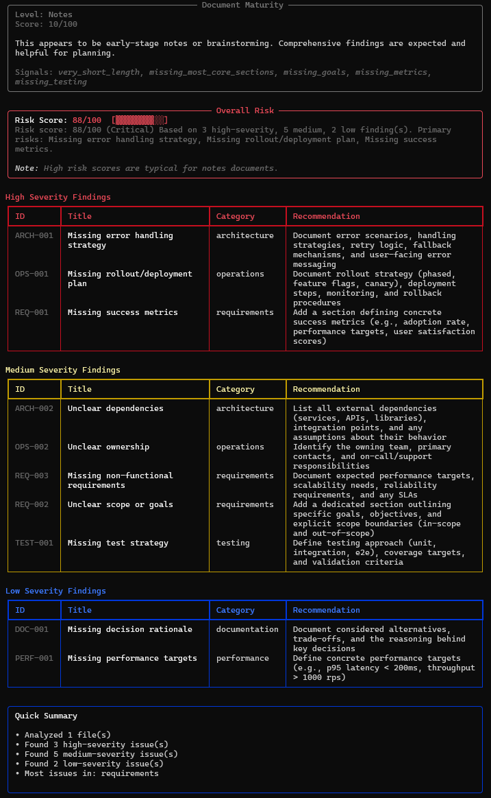

# Tiresias

[](https://github.com/bmaynard/tiresias/actions/workflows/ci.yml)

**Design review and pre-mortem analysis for engineering artifacts.**

Tiresias performs automated design reviews on engineering documents (design docs, ADRs, specs, and AI prompts) to identify missing considerations, risks, and potential failure modes *before* implementation. Think of it as a pre-mortem tool that catches issues early—when they’re still cheap to fix.

> **Opinionated by design:** if a concern is not documented, Tiresias treats it as missing.

---

## Who This Is For

Tiresias is designed for:

* Engineers writing design docs, ADRs, and architecture proposals
* Teams enforcing design quality gates in CI/CD
* Platform, SRE, and security teams reviewing early-stage designs
* AI engineers validating prompts and system specs before deployment

If your organization believes that **undocumented assumptions become production incidents**, Tiresias is for you.

---

## Features

* Analyzes Markdown, text, JSON, and YAML files
* Identifies missing:

  * error handling
  * success metrics
  * test strategies
  * rollout and rollback plans
* Configurable analysis profiles (`general`, `security`, `performance`, `reliability`)
* Deterministic heuristics (no LLM hallucination)
* Beautiful terminal output with risk scoring
* Machine-readable JSON output for CI/CD integration
* GitHub Action support for automated PR reviews
* Secret redaction for safe analysis

---

## Quick Demo

```bash
tiresias review examples/design.md
```

**Input:**
```
# Widget Service

We will build a widget service that handles widget creation and retrieval.

## Overview
It will be fast and scalable.
```

**Output:**
<p align="center">
  <br />
  <sub>
    Example output analyzing an early-stage design document.
    High risk is expected at the “Notes” maturity level.
  </sub>
</p>

High Severity Findings

```
ARCH-001  Missing error handling strategy
OPS-001   Missing rollout/deployment plan
REQ-001   Missing success metrics
```

---

## Evidence Mode

By default, Tiresias output stays clean and actionable. Use `--show-evidence` (or `--verbose`) to explain *why* each finding fired:

```bash
tiresias review examples/design.md --show-evidence
```

Example:

```
ARCH-001 Evidence:
  • No discussion of error handling, exceptions, failures, or fallback strategies
```

Evidence is always included in JSON output, regardless of CLI flags.

---

## Document Maturity

Tiresias assigns a **Document Maturity** label to contextualize findings:

| Level            | Score Range | Meaning                                         |
| ---------------- | ----------- | ----------------------------------------------- |
| Notes            | 0–25        | Early brainstorming, gaps expected              |
| Early Draft      | 26–50       | Incomplete sections, many gaps normal           |
| Design Spec      | 51–75       | Substantive design, findings indicate real gaps |
| Production-Ready | 76–100      | Comprehensive doc, findings are critical        |

> Maturity **does not affect risk score math**. Risk scoring is deterministic and stable.

---

## Installation

### Using uv (recommended)

```bash
git clone https://github.com/bmaynard/tiresias.git
cd tiresias
uv sync

uv run tiresias review docs/design.md
```

### As a tool

```bash
uv tool install tiresias

tiresias review docs/design.md
```

> **Note:** PyPI publishing is planned for a future release. For now, please install from source using the methods above.

---

## Quick Start

```bash
tiresias review docs/design.md

tiresias review docs/

tiresias review docs/ --format json --output report.json

tiresias review specs/ --profile security

tiresias review docs/ --fail-on high
```

---

## CLI Usage

```
tiresias review <PATH_OR_GLOB> [OPTIONS]
```

### Options

| Option                 | Default   | Description                         |
| ---------------------- | --------- | ----------------------------------- |
| `--format`             | `text`    | Output format: `text` or `json`     |
| `--severity-threshold` | `low`     | Minimum severity to display         |
| `--fail-on`            | `none`    | Exit nonzero if findings ≥ severity |
| `--profile`            | `general` | Analysis profile                    |
| `--show-evidence`      | `false`   | Show evidence for findings          |
| `--output`             | stdout    | Write output to file                |
| `--no-color`           | `false`   | Disable color output                |

---

## Explaining Rules

Use the `explain` command to get detailed information about specific rules:

```bash
# Explain a specific rule
tiresias explain REQ-001

# List all available rules
tiresias explain --list

# Get JSON output
tiresias explain ARCH-001 --format json
```

### Explain Options

| Option       | Default | Description                         |
| ------------ | ------- | ----------------------------------- |
| `--format`   | `text`  | Output format: `text` or `json`     |
| `--list`     | `false` | List all available rule IDs         |
| `--output`   | stdout  | Write output to file                |
| `--no-color` | `false` | Disable color output                |

### Example: Understanding a Finding

When you see a finding in your review:

```
REQ-001  Missing success metrics
```

Get details on how to address it:

```bash
$ tiresias explain REQ-001

╭──────────────────────────────────────────────────────────────────────────────╮
│ REQ-001: Missing success metrics                                             │
╰──────────────────────────────────────────────────────────────────────────────╯

Category: Requirements
Severity: High

What it checks:
  No section found discussing success criteria, metrics, or KPIs

Why it matters:
  Without measurable success criteria, it will be difficult to determine if the
  implementation achieves its goals or to make data-driven decisions

How to address it:
  Add a section defining concrete success metrics (e.g., adoption rate,
  performance targets, user satisfaction scores)
```

---

## Configuration File

Create a `.tiresias.yml` file in your repo root:

```yaml
default_profile: general

ignore_paths:
  - "test/**"
  - "drafts/**"

redact_patterns:
  - "internal-key-\\w+"

category_weights:
  security: 1.5
  reliability: 1.2
  documentation: 0.5
```

---

## JSON Output Schema (Example)

```json
{
  "metadata": {
    "tool_version": "0.3.0",
    "profile": "general",
    "model_provider": "heuristic"
  },
  "risk_score": 45,
  "findings": []
}
```

---

## GitHub Action Integration

```yaml
name: Design Review

on:
  pull_request:
    paths:
      - 'docs/**'
      - '**.md'

jobs:
  tiresias:
    runs-on: ubuntu-latest
    steps:
      - uses: actions/checkout@v4
      - uses: astral-sh/setup-uv@v5
      - run: uv sync
      - run: uv run tiresias review docs/ --fail-on high
```

---

## What Tiresias Checks (MVP)

* Requirements
* Architecture
* Testing
* Operations
* Security
* Performance
* Documentation

---

## Roadmap

* [x] Deterministic heuristic analysis
* [x] CLI with Rich output
* [x] JSON export for CI/CD
* [ ] LLM-assisted analysis (optional, opt-in)
* [ ] Custom rule plugins
* [ ] VS Code extension
* [ ] Interactive review mode

---

## Why “Tiresias”?

In Greek mythology, Tiresias was a blind prophet known for wisdom and foresight. This tool aims to provide foresight into design failures *before* they reach production.

---

## License

MIT License

---

## Contributing

1. Fork the repo
2. Create a feature branch
3. Commit your changes
4. Open a Pull Request
